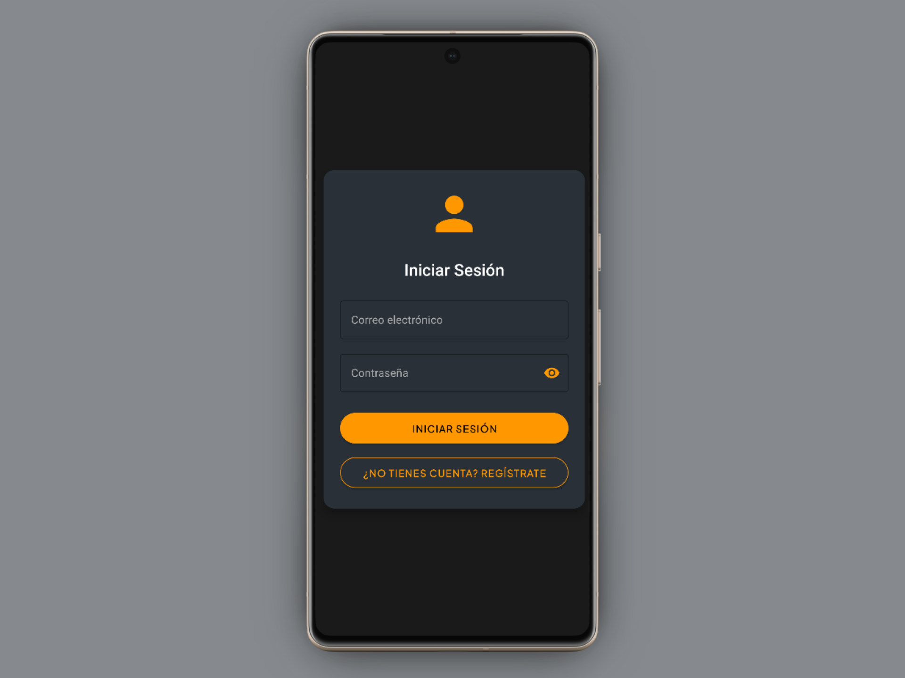
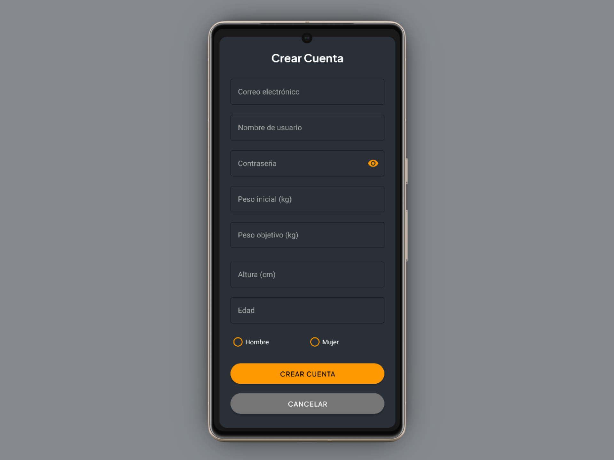
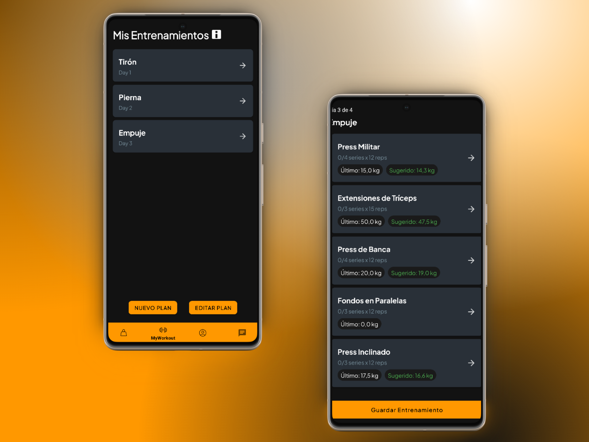
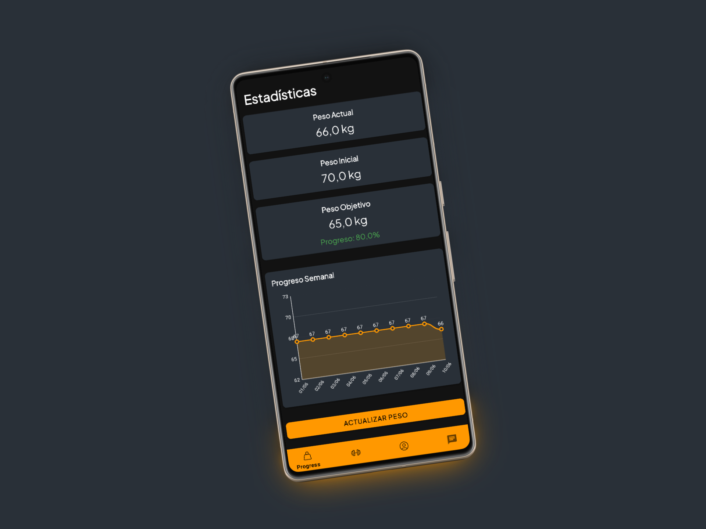

# LiftPath - Tu Compañero de Entrenamiento Personal

## 📱 Descripción
LiftPath es una aplicación móvil Android diseñada para ayudarte a alcanzar tus objetivos de fitness y seguir tu progreso de entrenamiento. Con una interfaz intuitiva y moderna, LiftPath te permite gestionar tus rutinas de ejercicio y monitorear tu progreso de peso de manera efectiva.
## 📸 Capturas de Pantalla

  <table>
    <tr>
      <td align="center">
        
         
        <em>Login</em>
      </td>
      <td align="center">
        
         
        <em>Registro</em>
      </td>
      <td align="center">
        
         
        <em>Realizar Entrenamientos</em>
      </td>
      <td align="center">
        
         
        <em>Gestionar entrenamientos</em>
      </td>
    </tr>
    <tr>
      <td align="center">
        
         
        <em>Seguimiento de Progreso</em>
      </td>
      <td align="center">
        
         
        <em>Perfil de Usuario</em>
      </td>
      <td align="center">
        
         
        <em>Lista de Ejercicios</em>
      </td>
    </tr>
  </table>

## ✨ Características Principales

### 🏋️‍♂️ Gestión de Entrenamientos
- Crea y personaliza tus propias rutinas de entrenamiento
- Añade ejercicios específicos a cada rutina
- Organiza tus entrenamientos por días
- Registra series, repeticiones y peso para cada ejercicio

### 📊 Seguimiento de Progreso
- Monitorea tu peso actual y progreso hacia tu objetivo
- Visualiza tu evolución con gráficos intuitivos
- Establece objetivos de peso personalizados
- Calcula automáticamente el porcentaje de progreso

### 👤 Perfil Personalizado
- Configura tu perfil con datos personales
- Establece tus objetivos de peso
- Visualiza estadísticas de entrenamiento
- Calcula calorías diarias recomendadas

### 🎯 Características Adicionales
- Interfaz moderna y fácil de usar
- Navegación intuitiva
- Modo oscuro por defecto
- Almacenamiento seguro de datos

## 🛠️ Tecnologías Utilizadas
- Lenguaje: Java
- Base de datos: Firebase Firestore
- Autenticación: Firebase Auth
- Gráficos: MPAndroidChart
- Diseño: Material Design Components

## 📱 Requisitos del Sistema
- Android 6.0 (API 23) o superior
- Conexión a Internet para sincronización de datos
- Espacio mínimo recomendado: 50MB

## 🚀 Instalación
1. Descarga la aplicación desde Google Play Store (próximamente)
2. Instala la aplicación en tu dispositivo Android
3. Crea una cuenta o inicia sesión
4. ¡Comienza a registrar tus entrenamientos!

## 💪 Cómo Empezar
1. **Registro**: Crea tu cuenta con email y contraseña
2. **Configura tu Perfil**: Añade tu peso actual y objetivo
3. **Crea tu Primera Rutina**: 
   - Pulsa en "Mis Entrenamientos"
   - Selecciona "Nuevo Plan"
   - Añade ejercicios a tu rutina
4. **Registra tu Progreso**:
   - Actualiza tu peso regularmente
   - Visualiza tu progreso en los gráficos
   - Monitorea tu porcentaje hacia el objetivo
5. **Chatea con la comunidad**:
   - Pulsa en el icono del chat
   - Comienza a escribir mensajes para resolver dudas y compartir tu progreso

## 🔒 Privacidad y Seguridad
- Todos los datos se almacenan de forma segura en Firebase
- Autenticación segura mediante Firebase Auth
- No se comparten datos con terceros
- Respaldo automático de datos

## 🤝 Contribución
Este proyecto es parte de un Trabajo de Fin de Grado (TFG) desarrollado por Daniel Mario. Si encuentras algún error o tienes sugerencias, por favor abre un issue en el repositorio.

## 📄 Licencia
Este proyecto está bajo la Licencia MIT. Ver el archivo `LICENSE` para más detalles.

## 👨‍💻 Desarrollador
- Daniel Blanco y Mario Sanchez
- Trabajo de Fin de Grado
- Ies Juan de la Cierva

---
© 2025 LiftPath. Todos los derechos reservados. 
